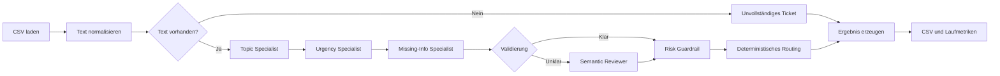

# Lokaler Agent zur Triage von Versicherungstickets

Dieses Projekt implementiert einen vollständig lokal laufenden Support-Triage-Agenten. Er liest Kundentickets aus dem öffentlichen *Customer IT Support – Ticket Dataset*, ordnet sie in einen Versicherungssupport-Kontext ein, bewertet ihre Dringlichkeit und schlägt den nächsten Bearbeitungsschritt vor.

Der Agent verwendet einen expliziten LangGraph-Workflow statt eines freien Agent-Loops. Semantische Entscheidungen werden von einem lokalen Qwen-Modell getroffen; Routing und sicherheitsrelevante Eskalationen bleiben als nachvollziehbare Geschäftslogik im Code.

## Architektur



Die Knoten haben bewusst getrennte Verantwortlichkeiten:

1. **Preprocess** kombiniert Betreff und Nachricht und bereinigt ausschließlich Formatierungsartefakte.
2. **Topic Specialist** klassifiziert das Ticket als Vertrag, Schaden, Abrechnung, Technik oder Sonstiges.
3. **Urgency Specialist** bewertet die Dringlichkeit als niedrig, mittel oder hoch.
4. **Missing-Info Specialist** identifiziert fehlende Angaben und erzeugt höchstens zwei Rückfragen.
5. **Validation Gate** erkennt unsichere, widersprüchliche oder mehrdeutige Ergebnisse.
6. **Semantic Reviewer** prüft ausschließlich diese schwierigen Fälle ein zweites Mal.
7. **Risk Guardrail** kann klar benannte Risiken ausschließlich hochstufen.
8. **Deterministic Router** übersetzt das Ergebnis in einen überprüfbaren nächsten Bearbeitungsschritt.

Alle Modellantworten werden direkt gegen Pydantic-Schemas validiert. Ausführliche interne Gedankengänge werden weder angefordert noch gespeichert; die Ausgabe enthält nur kurze, belegbare Entscheidungshinweise.

## Modellprofile

Der komplette Graph ist für beide Profile identisch. Lediglich Modell und Laufzeitparameter wechseln.

| Profil | Ollama-Modell | Downloadgröße | Geeignet für |
|---|---|---:|---|
| `quality` | `qwen3.5:35b-a3b-q4_K_M` | ca. 24 GB | RTX 3090 oder vergleichbare 24-GB-GPU |
| `compact` | `qwen3.5:9b` | ca. 6,6 GB | kleinere GPU oder CPU |

Das Quality-Profil nutzt bewusst die Q4_K_M-Variante und einen auf 4.096 Tokens
begrenzten Kontext. Das Modell reizt damit den Speicher einer RTX 3090 weitgehend
aus, ohne für die vergleichsweise kurzen Tickets unnötig großen KV-Cache zu reservieren.

## Voraussetzungen

- Windows, Linux oder macOS
- Python 3.12
- [uv](https://docs.astral.sh/uv/)
- [Ollama](https://ollama.com/download)
- ausreichend freier Speicher für das gewählte Modell

Eine NVIDIA-GPU ist für das Compact-Profil nicht zwingend erforderlich. Die Verarbeitung auf der CPU ist allerdings deutlich langsamer.

## Schnellstart

### 1. Python-Umgebung installieren

```powershell
uv python install 3.12
uv sync
```

Falls `uv` auf Windows kein Cache-Verzeichnis anlegen kann:

```powershell
$env:UV_CACHE_DIR = "$PWD\.cache\uv"
$env:UV_PYTHON_INSTALL_DIR = "$PWD\.cache\python"
uv python install 3.12
uv sync
```

### 2. Ollama-Modell laden

Für die RTX-3090-Variante:

```powershell
ollama pull qwen3.5:35b-a3b-q4_K_M
```

Für die portable Variante:

```powershell
ollama pull qwen3.5:9b
```

Ollama muss vor dem Lauf gestartet sein. Standardmäßig wird `http://localhost:11434` verwendet. Eine andere lokale Adresse kann über `OLLAMA_BASE_URL` gesetzt werden.

### 3. Dataset herunterladen

Verwendet wird das Kaggle-Dataset:

[Customer IT Support – Ticket Dataset](https://www.kaggle.com/datasets/tobiasbueck/multilingual-customer-support-tickets)

Die ZIP-Datei kann manuell entpackt werden. Mindestens eine CSV-Datei muss anschließend unter `data/raw/` liegen:

```text
data/
└── raw/
    └── tickets.csv
```

Alternativ mit konfigurierter Kaggle-CLI:

```powershell
uvx kaggle datasets download `
  -d tobiasbueck/multilingual-customer-support-tickets `
  -p data/raw `
  --unzip
```

Die Quelldaten werden nicht verändert und nicht in das Repository aufgenommen. Für die Inferenz werden nur `subject`, `body` und `language` verwendet. Vorhandene Antworten, Queues, Prioritäten und Tags bleiben vom Modellinput ausgeschlossen.

### 4. Triage starten

Quality-Profil:

```powershell
uv run triage quality
```

Compact-Profil:

```powershell
uv run triage compact
```

Das Profil ist das einzige Pflichtargument. Standardmäßig werden automatisch 200 eindeutige englische Tickets mit Seed 42 ausgewählt.

Der klassische Einstiegspunkt funktioniert ebenfalls:

```powershell
uv run python main.py quality
```

## Optionale CLI-Parameter

```powershell
uv run triage quality --limit 10
uv run triage compact --input data/raw/tickets.csv
uv run triage quality --language de --output outputs/german.csv
uv run triage quality --seed 123
```

| Parameter | Standard | Bedeutung |
|---|---:|---|
| `--input` | automatische Erkennung | explizite Dataset-CSV |
| `--output` | profilabhängig | Zielpfad der Ergebnis-CSV |
| `--language` | `en` | Sprachcode des Datasets |
| `--limit` | `200` | maximale Anzahl eindeutiger Tickets |
| `--seed` | `42` | Seed für reproduzierbares Sampling |

Ohne `--input` wird unter `data/raw/` die größte CSV mit den Spalten `subject`, `body` und `language` gewählt.

## Ausgaben

Der Standardlauf erzeugt:

```text
outputs/
├── triage_results_quality.csv
└── triage_results_quality_summary.json
```

Die CSV enthält:

- Ticket-ID und Textausschnitt
- Topic und Topic-Konfidenz
- Urgency und Urgency-Konfidenz
- empfohlenen nächsten Bearbeitungsschritt
- fehlende Informationen und Rückfragen
- verwendetes Modellprofil
- Reviewer- und Verarbeitungsstatus
- Laufzeit und kurze Notes

Ein Ticket mit Modellfehler erhält keine erfundene Klassifikation. Der Fehler wird in einer eigenen Ergebniszeile dokumentiert und die restliche Batchverarbeitung fortgesetzt.

## Profile vergleichen

Sind beide Modelle installiert, verarbeitet der Vergleich automatisch dieselben 25 Tickets:

```powershell
uv run triage-compare
```

Jedes Profil erhält vor der Messung einen einzelnen Warm-up-Durchlauf. Dieser ist
nicht Teil der Metriken, damit der Modellwechsel die Laufzeitwerte nicht verzerrt.

Das Ergebnis unter `outputs/profile_comparison.json` enthält:

- Übereinstimmung bei Topic, Urgency und Next Action
- mittlere, P50- und P95-Laufzeit
- Reviewer- und Missing-Information-Rate
- Fehlerquote beider Profile

## Graph exportieren

Der Graph kann ohne gestartetes Modell als Mermaid-Datei exportiert werden:

```powershell
uv run triage-graph
```

Standardziel ist `docs/triage_graph.mmd`.

## Tests und Qualitätsprüfungen

Die Unit- und Graphtests verwenden Fake-Modelle und benötigen daher weder Ollama noch eine GPU:

```powershell
uv run pytest
uv run ruff check .
uv run ruff format --check .
```

Abgedeckt werden unter anderem:

- Profilauflösung
- Dataset-Erkennung und reproduzierbares Sampling
- Textnormalisierung
- Pydantic-Verträge
- bedingter Reviewer-Pfad
- Risk Guardrail
- Routing-Prioritäten
- Fehlerbehandlung und CSV-Serialisierung

## Zentrale Architekturentscheidungen

- **Expliziter Graph statt freiem ReAct-Loop:** leichter zu testen, visualisieren und auditieren.
- **Spezialisierte Modellaufrufe:** Topic, Urgency und fehlende Informationen werden getrennt beurteilt.
- **Gleicher Graph für beide Modelle:** ein Profilwechsel verändert keine Geschäftslogik.
- **Strukturierte Ausgaben:** ungültige Modellantworten werden wiederholt und anschließend sauber als Fehler behandelt.
- **Deterministisches Routing:** operative Maßnahmen hängen nicht von frei formuliertem Modelltext ab.
- **Lokale Verarbeitung:** Nach Download von Dataset und Modellen werden keine Ticketdaten an externe Dienste übertragen.

## Einschränkungen und Weiterentwicklung

- Das öffentliche Dataset enthält synthetische IT-Support-Tickets und keine echten Versicherungsvorgänge.
- Modellkonfidenzen sind Selbsteinschätzungen und nicht statistisch kalibriert.
- Der Prototyp besitzt keine fachlich gelabelte Versicherungstestmenge.
- Regeln und Prompts ersetzen keine Freigabe durch Versicherungsfachleute.
- Die aktuelle Version verarbeitet Tickets sequenziell und bietet weder API noch Benutzeroberfläche.

Sinnvolle nächste Schritte wären ein fachlich geprüftes Gold-Set, Konfidenzkalibrierung, Prompt-Versionierung mit Regressionstests, lokales Monitoring sowie eine FastAPI- oder Streamlit-Oberfläche.

## Dataset-Attribution

Das Projekt basiert auf dem öffentlichen Kaggle-Dataset *Customer IT Support – Ticket Dataset* von Tobias Bueck. Die Rohdaten sind nicht Bestandteil dieses Repositorys und müssen separat gemäß den auf Kaggle angegebenen Lizenzbedingungen bezogen werden.

Eine ausführlichere technische Einordnung befindet sich in [TECHNICAL.md](TECHNICAL.md).
