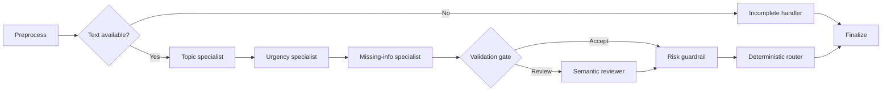

# Technical Design: Local Insurance Support Ticket Triage Agent

## A. Problem understanding

### Business interpretation

The prototype treats triage as a decision-support process between an incoming customer message and an internal support queue. Its purpose is not to make coverage decisions, approve claims, or answer customers autonomously. It creates a consistent first assessment containing a topic, urgency, next action, and any information that should be requested before processing can continue.

The source data contains IT support messages rather than real insurance cases. The prototype therefore preserves the literal meaning of each message and maps it into the closest insurance-support category without inventing policies, claims, losses, or customer details. Account and portal problems map naturally to Technical / Online Access. Payment issues map to Billing / Payment. Damage reports map to Claims / Damage. Tickets without a defensible mapping remain Other.

### Assumptions

- Topic labels are intentionally broad: Policy / Contract, Claims / Damage, Billing / Payment, Technical / Online Access, and Other.
- Urgency represents operational handling priority, not legal or actuarial severity.
- High urgency is reserved for explicit immediate risk, active fraud, severe ongoing damage, data loss, or complete outages.
- The system recommends a queue-level next action. It does not execute actions in downstream systems.
- Missing information is topic-dependent. A short ticket is not automatically incomplete if its request is still actionable.
- A human supervisor is the safe destination for high-risk, medium-priority Other, or otherwise unsupported cases.

## B. Data and preprocessing

### Dataset selection

The application uses the public Kaggle *Customer IT Support – Ticket Dataset*. The loader searches for the largest CSV containing `subject`, `body`, and `language`, while still allowing an explicit file path. The default run selects 200 unique English tickets with a deterministic random seed of 42.

Only subject, body, language, and a ticket identifier are used. Existing answers, queues, priorities, ticket types, and tags are excluded from inference to prevent label leakage. The original source file is never modified.

### Preprocessing

Preprocessing intentionally remains light:

1. Decode HTML entities.
2. Remove simple HTML tags.
3. Normalize line endings and repeated whitespace.
4. Combine subject and body with a visible paragraph boundary.
5. Remove exact subject/body duplicates before sampling.

Case, punctuation, sentence structure, spelling, and domain terminology are retained because the language model relies on them. The model input is capped at 6,000 characters, which comfortably covers the observed ticket size while protecting local inference from unexpectedly large rows.

## C. Architecture and tools

### Overview

The implementation uses an explicit LangGraph `StateGraph`. Each node receives and updates typed shared state. Conditional edges make the uncertain path visible and testable.

### Main components

- **LangGraph:** explicit orchestration, conditional routing, and graph visualization.
- **Ollama:** fully local model serving and native JSON-schema constrained generation.
- **Qwen3.5:** one high-quality MoE profile and one compact profile.
- **Pydantic:** validation contracts between model calls, graph state, CSV output, and tests.
- **pandas:** robust CSV inspection, filtering, deterministic sampling, and export.
- **Typer/Rich:** minimal CLI, clear preflight errors, and progress display.
- **Streamlit:** local live progress, run inspection, sample exploration, and profile comparison.
- **pytest/Ruff:** model-independent correctness tests and static quality checks.

No paid SaaS, remote inference service, vector database, or hosted observability product is used.

### Model profiles

The `quality` profile uses `qwen3.5:35b-a3b-q4_K_M`, an approximately 24 GB
download selected to use nearly all of a 24 GB RTX 3090. Context is deliberately
limited to 4,096 tokens because support tickets are short and a larger KV cache
would increase the risk of CPU offloading without improving this task. The
platform-specific INT4 build was rejected because Ollama currently exposes that
tag as a macOS-only artifact.

The `compact` profile uses `qwen3.5:9b` with a 4,096-token context. Both profiles share prompts, output schemas, review thresholds, graph topology, and routing logic. This makes the profile comparison meaningful and prevents a hardware-dependent change in business behavior.

### Structured model boundary

Every model call is constrained with the JSON schema generated from its Pydantic output type. If an older Ollama build ignores the schema and returns prose, retries switch to JSON mode and append the compact schema directly to the request. Invalid JSON or schema violations are retried twice. Exhausted retries produce an explicit error result with the final validation cause instead of a fabricated classification.

The application requests short evidence and notes, not hidden chain-of-thought. Ticket text is framed as untrusted data, and prompts explicitly prohibit following instructions embedded inside the ticket.

## D. Agentic workflow and behavior

### Decision process

The Topic Specialist assigns one category and may identify a secondary category. The Urgency Specialist independently assesses handling priority and extracts explicit risk signals. The Missing-Info Specialist then evaluates completeness against topic-specific requirements and may generate up to two clarification questions.

The Validation Gate requests a second semantic review when:

- topic or urgency confidence is below 0.70;
- a secondary topic exists;
- the result is Other;
- High urgency has no explicit risk signal;
- the ticket is ambiguous or contains multiple issues; or
- the completeness decision is internally inconsistent.

The reviewer receives the original ticket and all prior structured assessments. It may correct classification and completeness but cannot execute tools or change routing rules.

### Missing information

Requirements are deliberately small:

- Policy / Contract needs the relevant product or contract context and the requested information or change.
- Claims / Damage needs the incident or damage and enough timing/context to understand it.
- Billing / Payment needs transaction or invoice context and the concrete discrepancy.
- Technical / Online Access needs the affected account/channel and the observed symptom.
- Other needs a clear problem or request.

Empty tickets bypass all models and receive an explicit clarification question.

### Model-based and rule-based responsibilities

LLMs handle semantic interpretation: topic, urgency, completeness, and ambiguity review. Rules handle invariants:

- a small risk guardrail may promote but never demote urgency;
- High urgency always routes to a human supervisor;
- missing information is resolved before normal queue routing;
- topic-to-queue mappings are deterministic.

This division is intentional. Language understanding benefits from a learned model, while business actions should remain predictable and auditable.

## E. End-to-end testing and evaluation

### Test strategy

Unit and graph tests use an injected fake model client. They cover:

- profile configuration;
- input discovery and schema validation;
- normalization and deterministic sampling;
- typed model output handling and retry behavior;
- confident paths that skip review;
- ambiguous paths that invoke review;
- guardrail promotion;
- routing precedence;
- empty tickets without model calls;
- continued batch processing after an individual error; and
- CSV serialization.

The synthetic scenario set includes routine policy questions, complete and incomplete claims, duplicate payments, login problems, very short messages, mixed-topic tickets, active fraud, and out-of-scope requests. Expected labels are defined only for these synthetic tests. The Kaggle dataset is not manually relabeled.

### Runtime evaluation

Each batch produces a summary with:

- successful, incomplete, and failed ticket counts;
- topic, urgency, and action distributions;
- semantic review rate;
- missing-information rate;
- mean, P50, and P95 latency.

`triage-compare` gives each profile one excluded warm-up ticket, then evaluates both profiles on the same deterministic 25-ticket sample. It measures topic, urgency, and action agreement together with warm runtime and failure statistics. Agreement is not treated as accuracy; it is a diagnostic signal for the hardware/quality trade-off.

### Longer-term metrics

A production system should add a domain-expert-labeled holdout set and track macro F1 by topic, recall for High urgency, routing accuracy, clarification usefulness, human override rate, latency, model failure rate, drift by language, and outcome metrics from downstream teams.

## F. Limitations and improvements

### Current limitations

- The dataset is synthetic and IT-oriented rather than representative insurance data.
- There is no domain-expert-labeled insurance evaluation set.
- Model confidence is self-reported and not statistically calibrated.
- Quantization can change structured-output reliability and classification quality.
- English is the evaluated default; German is supported as a filter but needs its own regression suite.
- Risk terms are deliberately conservative and incomplete.
- Tickets are processed sequentially to avoid GPU contention and simplify reproducibility.
- The local dashboard is an operator aid, not an authenticated multi-user application.
- The prototype has no API, persistent queue, or production monitoring.

### Two-week extension

With two additional weeks, the first priority would be a small, privacy-safe, domain-expert-reviewed insurance benchmark. Prompts, thresholds, and guardrails would be tuned only against a development partition, followed by a blind evaluation.

The next improvements would include calibrated confidence, batch-safe GPU concurrency, local trace storage, prompt and model version regression reports, German test coverage, privacy redaction, and an explicit human-feedback workflow. The existing dashboard could then add filtering, annotations, and reviewer decisions; a FastAPI service could expose the same graph without changing its core decision logic. Production deployment would add containerization, queue-based execution, health checks, audit retention, access control, and monitoring.
